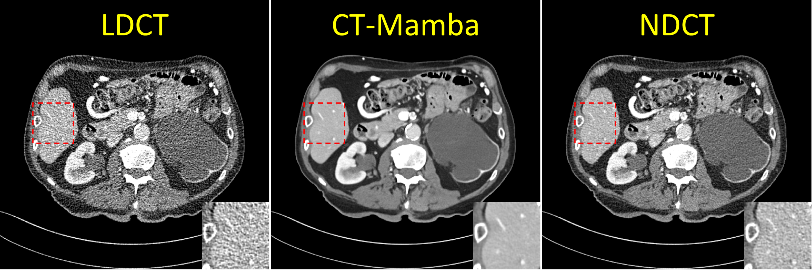

# CT-Mamba: A Hybrid Convolutional State Space Model for Low-Dose CT Denoising
Linxuan Li<sup>
  <a href="mailto:linxuan.li@163.com" title="Email">
    
  </a>
</sup>, Wenjia Wei, Luyao Yang, Wenwen Zhang, Jiashu Dong, Yahua Liu, Hongshi Huang and Wei Zhao

[](https://doi.org/10.1016/j.compmedimag.2025.102595) [](https://arxiv.org/abs/2411.07930)

## 🐍 Project Introduction

This is the official implementation of the paper ***CT-Mamba: A Hybrid Convolutional State Space Model for Low-Dose CT Denoising.***

We provide a basic framework for training and inference of the CT-Mamba.

<p align="center">
  
</p>
<p align="center">
  <em>Fig. 1. The overall architecture of the proposed CT-Mamba. (b) The structure of the Multi-Scale Coherence Mamba architecture (MSC-Mamba)
in CT-Mamba.</em>
</p>
<hr />
<p align="center">
  
</p>
<p align="center">
  <em>Fig. 2. Detailed structure of the dual-branch Deep NPS Loss and its key components. (a) Structure of the Deep NPS Loss. (b) Detailed structure
of the u-Feature Net.</em>
</p>
<hr />

## 📂 Dataset Preparation

Please organize data directory as follows:
```bash
data/
├── train/
│ ├── input/ # Low-dose
│ └── target/ # Normal-dose
├── val/
│ ├── input/
│ └── target/
```
We provide a preprocessed version of the [AAPM-Mayo Low Dose CT Challenge 2016 dataset](https://www.aapm.org/GrandChallenge/LowDoseCT/).
All images are normalized to the range [0, 1].

[](https://drive.google.com/drive/folders/1sEkeNTevdSkWzcpN1WBO_VDEjmQBVW3N?usp=sharing)


Note: A constant shift (+1024 HU) has been added during preprocessing. To recover the original Hounsfield Units (HU):
```bash
image = image * 4096.0 - 1024.0
```

## 🛠️ Main Environment
[](https://drive.google.com/drive/folders/1zxjqXjsAmGFu-EhGEgbWyeY7wW5pBGLw?usp=sharing)
```bash
 Python: 3.8
 PyTorch: 1.13.0 (CUDA 11.7)
 Mamba Dependencies:
  - mamba-ssm==1.0.1 
  - causal-conv1d==1.0.0
```

## 🔥 Training
Configure training parameters in optionsmamba.py, such as:
- Dataset paths
- Learning rate
- Number of epochs
- Batch size

Then start training with:
```bash
python train/train_denoise.py
```

## 🚀 Inference
You can use the provided pretrained model (trained on the AAPM-Mayo dataset):
[](https://drive.google.com/file/d/1mnbuAii42XhFUC7L_nM8qFnJs6tpXLk3/view?usp=sharing)

Or use your own trained model for inference.

Run the following command after configuring the parameters in Predict.py:
Then start training with:
```bash
python Predict.py
```

<p align="center">
  
</p>


## 📚 Citation
If you find this work helpful, please cite our paper:
```bash
@article{LI2025102595,
title = {CT-Mamba: A hybrid convolutional state space model for low-dose CT denoising},
journal = {Computerized Medical Imaging and Graphics},
pages = {102595},
year = {2025},
issn = {0895-6111},
doi = {https://doi.org/10.1016/j.compmedimag.2025.102595},
url = {https://www.sciencedirect.com/science/article/pii/S0895611125001041},
author = {Linxuan Li and Wenjia Wei and Luyao Yang and Wenwen Zhang and Jiashu Dong and Yahua Liu and Hongshi Huang and Wei Zhao},
}
```

## 📫 Contact
Feel free to reach us at:
✉️: [linxuan.li@163.com](mailto:linxuan.li@163.com) / [weiwenjia@buaa.edu.cn](mailto:weiwenjia@buaa.edu.cn)
