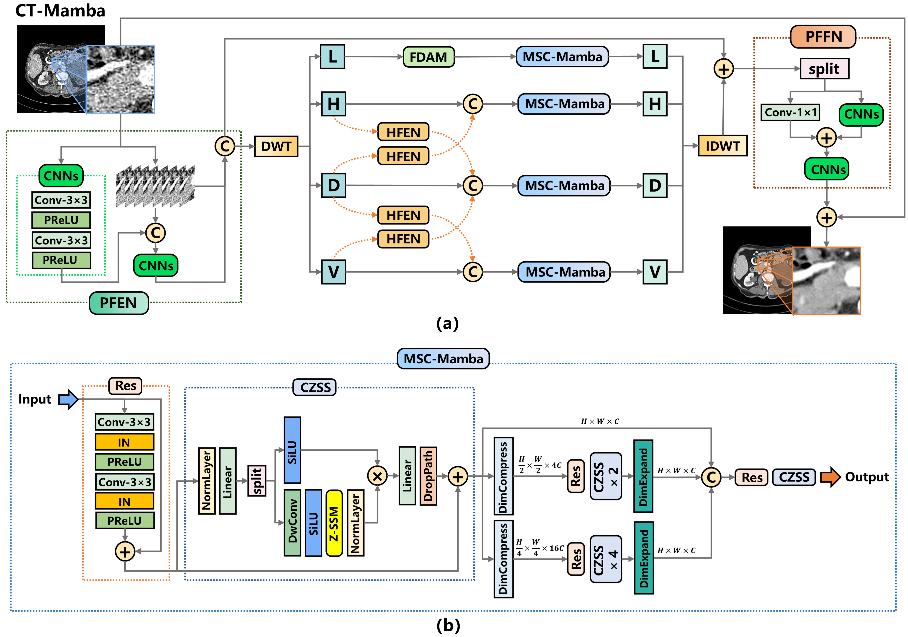

# CT-Mamba: A Hybrid Convolutional State Space Model for Low-Dose CT Denoising   
Linxuan Li, Wenjia Wei, Luyao Yang, Wenwen Zhang, Jiashu Dong, Yahua Liu, Hongshi Huang and Wei Zhao
[](https://arxiv.org/abs/2411.07930)


## Project Introduction

This is the official implementation of the paper ***CT-Mamba: A Hybrid Convolutional State Space Model for Low-Dose CT Denoising.***

<hr />


> **Fig. 1.** *The overall architecture of the proposed CT-Mamba. (b) The structure of the Multi-Scale Coherence Mamba architecture (MSC-Mamba)
in CT-Mamba.* 
<hr />

<hr />


> **Fig. 2.** *Detailed structure of the dual-branch Deep NPS Loss and its key components. (a) Structure of the Deep NPS Loss. (b) Detailed structure
of the u-Feature Net.* 
<hr />

## Current Status

Currently, our source code has not been released, but we plan to open-source it after the paper is officially published, allowing the researchers and developers in the community can reproduce our work and further improve the model.

## Installation and Usage (Coming Soon)

We will provide detailed installation steps and usage instructions in the upcoming open-source release. The release will include:

- Installation dependencies
- Usage examples
- Training and testing procedures

## Contribution

We welcome your suggestions regarding our code. If you have any questions, feel free to contact us via email at:
[linxuan.li@163.com] or [weiwenjia@buaa.edu.cn]

## Citation
```
@misc{li2025ctmambahybridconvolutionalstate,
      title={CT-Mamba: A Hybrid Convolutional State Space Model for Low-Dose CT Denoising}, 
      author={Linxuan Li and Wenjia Wei and Luyao Yang and Wenwen Zhang and Jiashu Dong and Yahua Liu and Hongshi Huang and Wei Zhao},
      year={2025},
      eprint={2411.07930},
      archivePrefix={arXiv},
      primaryClass={eess.IV},
      url={https://arxiv.org/abs/2411.07930}, 
}
```

